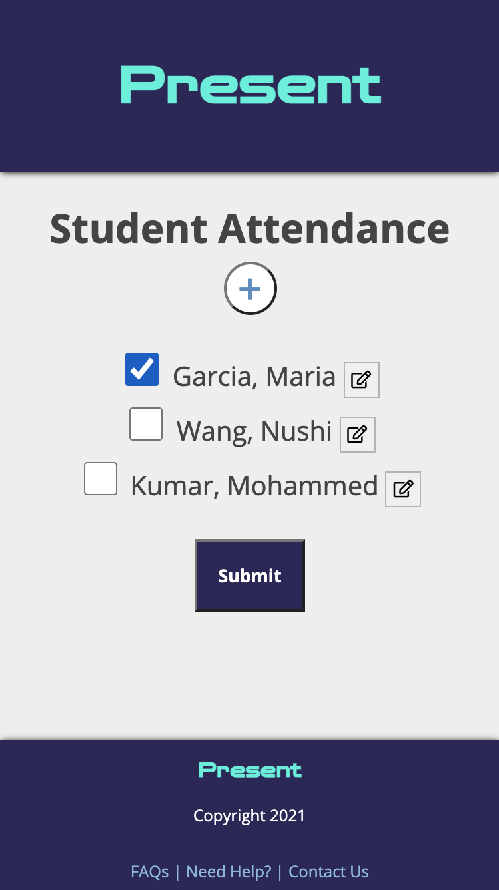

# Present client

## Overview
This app was built for teachers to track their student attendance.

## Features
Take attendance of your classroom, add students, edit student profiles, and view student and classroom attendance history.

## Running the project locally
Live version: https://present-client-bluwakpa.vercel.app/

Repository: 

1. Clone the project locally
2. Install dependancies `npm install`
3. Start the application `npm start`

## Tech Stack
React
Node
Express
PostgreSQL

## API Documentation

Live version: https://hidden-sands-54930.herokuapp.com

| Method | URL  | Success  | Error |
| :-----: | :-: | :-: | :-: |
| GET | /api/tasks | 200 | 400 |
| POST | / | 201 | 400 |
| DELETE | /:id | 204 | 400 |
| PATCH | /:id | 204 | 400 |

## Features Todo
1. Delete Student Confirmation
2. Edit Student Button Redesign
3. Button Hover Features

## Screenshots

